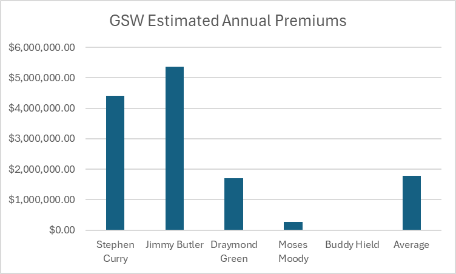
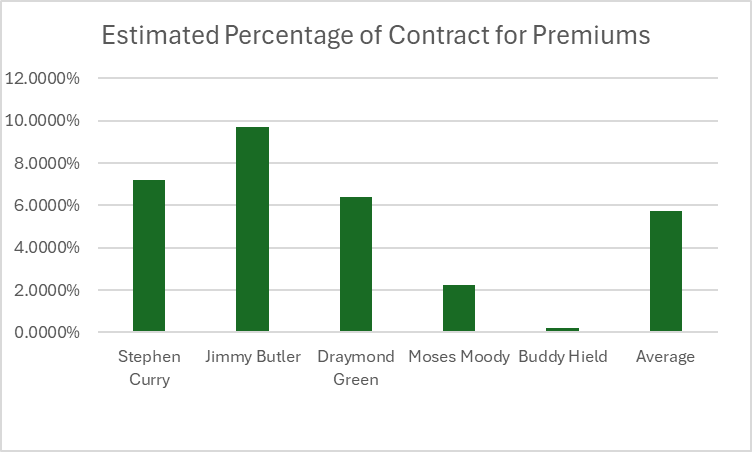
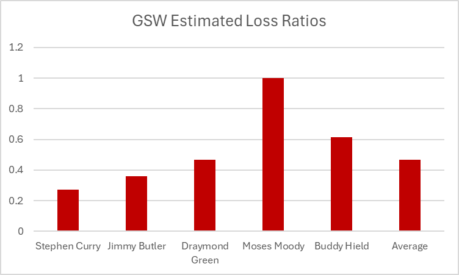

# NBA Salary Insurance Pricing Model

This actuarial project calculates salary insurance premiums for the top 5 players on each NBA team, covering the risk of a player missing **41 or more consecutive games** due to injury. The insurance policy is structured to **pay 80% of the player's salary per game missed** beyond that threshold.

---

## 📌 Objective

The goal is to simulate the actuarial pricing of career-impacting injury insurance using real player data, industry-based assumptions, and probabilistic modeling. This project replicates real-world practices insurers might follow when underwriting contracts for professional athletes.

---

## 🔢 Data Collection

Manually gathered data for each player includes:

- Team
- Age (as of the 2025–26 season)
- Years remaining on contract
- Position
- Weight
- Previous injuries (type + surgery status)
- Games played
- Games missed over career and last 2 seasons

Sources include NBA.com, ESPN, Spotrac, and Basketball Reference.

---

## ⚙️ Methodology

### 1. **Injury Percentage Estimation**
- Calculated a **weighted average** of games missed (career + recent seasons)
- Divided by 82 to estimate expected games missed next season
- Adjusted using the conditional probability of **missing 41+ games**:
  - ~61% of players get injured each season
  - ~10% of those suffer season-ending or 41+ game injuries
  - So: `P(41+ games | injury) = 10% / 61%`

### 2. **Expected Loss Calculation**
```excel
Expected_Loss = Injury_Prob_41plus × Annual Salary × 80%
```

### 3. **Premium Calculation**
```excel
Present_Value_Loss = Expected_Loss / (1 + i), where i = 3% interest
premium = [expected_loss / (1 + i)] × age_factor × contract_factor × position_factor × injury_factor × (1 + risk_load) × (1 + admin_load)
```

### 4. **Final Premium as % of Salary**
```excel
Premium % = Premium / Annual Salary
```

---

## 📈 Assumptions

### 🔹 Risk & Admin Loadings
| Type           | Value | Rationale |
|----------------|-------|-----------|
| Risk Loading   | 25%   | To buffer against volatility and adverse selection |
| Admin Loading  | 5%    | To cover underwriting and administrative expenses |

### 🔹 Multiplicative Rating Factors

| Variable         | Factor Logic |
|------------------|--------------|
| **Age Factor**   | <25 = 0.8, 25–29 = 1.0, 30–34 = 1.3, 35+ = 1.7 |
| **Contract Factor** | 1 yr = 0.9, 2+ yrs = 1.1 |
| **Position Factor** | Centers (C) = 1.2; all others = 1.0 |
| **Injury Factor**   | See detailed criteria below |

### 🩺 Injury Factor Criteria

| Injury Type                      | Examples                            | Factor | Rationale |
|----------------------------------|-------------------------------------|--------|-----------|
| No Injury History                | —                                   | 0.9    | Strong durability |
| Minor Injury (No Surgery)       | Mild sprains, contusions            | 1.0    | Baseline |
| Moderate (Recurring, No Surgery)| Tendinitis, strains                 | 1.2    | Recurrence risk |
| Moderate (Surgical)             | Meniscus repair, hand surgery       | 1.3    | Downtime but recovery |
| Major Lower Body Injury         | ACL, Achilles, patellar tendon      | 1.5    | Career-altering |
| Multiple Major Injuries         | ACL + Achilles, etc.                | 1.7    | Elevated long-term risk |
| Recent Major Injury             | Within past 12 months               | 1.6–1.8| Incomplete recovery risk |
| Chronic Condition               | Back/knee degeneration              | 1.6    | Red flag for insurers |

---

## ✅ Results

- **Average Premium % of Salary:** 5.72%
- **Real-world Benchmark:** Salary insurance typically costs 4–7% of annual salary
- **Average Loss Ratio**: **0.47**

### 📉 Loss Ratio Validation
Loss Ratio = Expected Loss / Premium  
While industry target is ~70–80%, a lower value reflects:
- Conservative pricing for high-severity, low-frequency risk
- Incomplete historical injury exposure data
- Tailored pricing due to lack of large-sample NBA insurance studies

---

## Example- Golden State Warriors: Salary Insurance Analysis

### Estimated Annual Premiums


### Estimated Percentage of Contract for Premiums


### Estimated Loss Ratios



## 📂 Files

- `Top 5 Player Salary Insurance.xlsx`: Full actuarial model
- `README.md`: Project explanation

---

## 🔍 Future Work

- Automate player data scraping from public APIs
- Use Bayesian modeling or survival analysis for injury risk
- Explore reinsurance pricing layer for high-value contracts

---

## 📬 Contact

Feel free to reach out if you’re interested in sports analytics, actuarial science, or insurance modeling!

## References

1. ["Claim Game" – The Economist (2013)](https://www.economist.com/finance-and-economics/2013/01/26/claim-game)  
   Overview of the sports insurance industry and claim dynamics.

2. [NBA Player Contracts – Basketball Reference](https://www.basketball-reference.com/contracts/)  
   Source for player salary and contract data.

3. [NBA Player Stats & Comparisons – StatMuse](https://www.statmuse.com/nba)  
   Used for quick player queries and historical data.

4. ["Insuring the Stars" – ESPN (2003)](https://www.espn.com/sportsbusiness/s/2003/0311/1521986.html)  
   Insight into how disability insurance was handled in the early 2000s.

5. ["New Deal to Give NBA Players $2.5M Disability Insurance" – ESPN (2020)](https://www.espn.com/nba/story/_/id/29566104/new-deal-give-nba-players-25m-disability-insurance-sources-say)  
   Details on recent insurance policy updates for NBA players.

6. [Report: NBA Raises Insurance Payout to $2.5M for Career-Ending Injuries – NBC Sports](https://www.nbcsports.com/nba/news/report-nba-raises-insurance-payout-to-2-5-million-for-career-ending-injuries)  
   Confirmation of increased policy limits for career-ending injuries.
